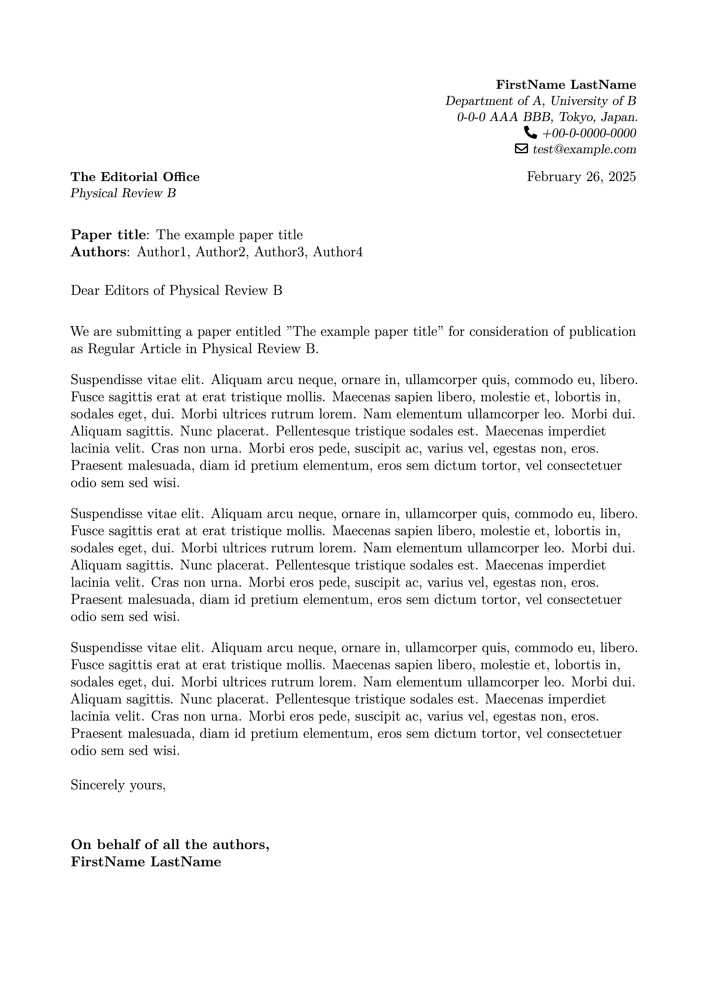

# LaTeX Cover Letter Template for Manuscript Submission

This directory contains a LaTeX template for creating cover letters for academic manuscript submissions. The template uses the `moderncv` document class to produce a well-formatted, elegant cover letter suitable for journal submissions.

## Overview

The cover letter template (`coverletter.tex`) is designed for academic authors who need to prepare a formal letter when submitting manuscripts to scientific journals. It provides a clean, professional format with appropriate sections for all the necessary information.

## Image

<p float="left">
  
</p>


## Requirements

To compile this template, you need:

- A LaTeX distribution (e.g., TeX Live, MiKTeX)
- The `moderncv` document class
- The `geometry` package (included in most LaTeX distributions)
- The `lipsum` package (for dummy text, can be removed in your actual letter)

## Usage

### Basic Configuration

1. Edit the personal details:
   ```latex
   \name{FirstName}{LastName}
   \title{Title}
   \address{Department of A, University of B}{0-0-0 AAA BBB, Tokyo, Japan.}
   \phone[fixed]{+00-0-0000-0000}
   \email{test@example.com}
   ```

2. Set the recipient information:
   ```latex
   \recipient{The Editorial Office}{Physical Review B}
   ```

3. Update the paper title and author list:
   ```latex
   \opening{\textbf{Paper title}: The example paper title \\
   \textbf{Authors}: Author1, Author2, Author3, Author4}
   ```

### Writing Your Letter

Replace the placeholder `\lipsum[10]` sections with your actual content:

1. Introduction paragraph - Briefly introduce your paper and its significance
2. Methods and results - Highlight key methods and findings
3. Conclusion - Summarize why the paper is suitable for the journal

### Compilation

Compile the document using `latexmk`:

```bash
latexmk coverletter.tex
```

## Customization Options

### Style Options

The template uses the "classic" style by default, but you can change it:

```latex
\moderncvstyle{classic} % Other options: 'casual', 'oldstyle', 'banking'
```

### Color Options

Uncomment and edit the color line to change the accent color:

```latex
% \moderncvcolor{green} % Options: 'blue', 'orange', 'green', 'red', 'purple', 'grey', 'black'
```

### Page Margins

Adjust the scaling factor in the geometry package to change margins:

```latex
\usepackage[scale=0.8]{geometry} % Increase value for larger margins
```

## Example

The template includes example text using the `lipsum` package. This generates placeholder text that should be replaced with your actual content in your final cover letter.

